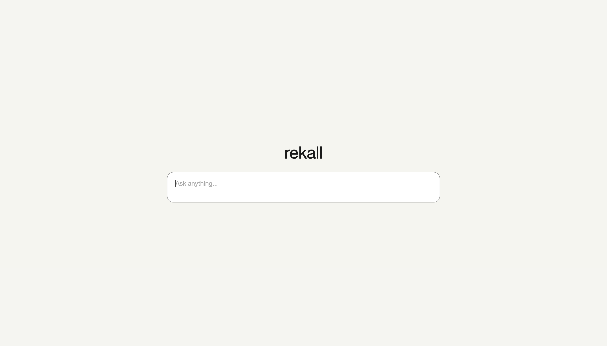
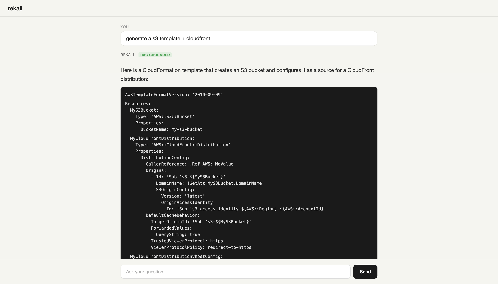

# total-rekall

A RAG (Retrieval-Augmented Generation) system for querying documentation using natural language. Scrapes, chunks, and embeds documents into a vector database, then uses a local LLM to answer questions grounded in the ingested content. Runs entirely locally  - no API keys needed.





## Architecture

1. Scrape documentation pages
2. Chunk text into overlapping segments
3. Generate vector embeddings for each chunk
4. Store chunks and embeddings in PostgreSQL (pgvector)
5. User submits a question
6. Generate embedding for the question
7. Find the most similar chunks via cosine distance
8. Send matched chunks + question to Ollama LLM
9. Return answer with sources and relevance score

- **Embeddings**: sentence-transformers (all-MiniLM-L6-v2)
- **Vector store**: PostgreSQL + pgvector
- **LLM**: Ollama (runs locally, GPU-accelerated on macOS)
- **API**: FastAPI
- **Frontend**: Chat UI at localhost:8000

## How it works

### Ingestion (`POST /ingest`)

1. **Scrape**  - Fetches documentation pages and extracts links to individual resource/topic pages.
2. **Fetch**  - Downloads each page, strips navigation/scripts/headers, and extracts raw text content.
3. **Chunk**  - Splits text into ~1000-word overlapping windows (200-word overlap so context isn't lost at chunk boundaries).
4. **Embed**  - Runs each chunk through sentence-transformers (`all-MiniLM-L6-v2`), which converts text into a 384-dimensional vector that captures semantic meaning.
5. **Store**  - Saves each chunk and its vector into PostgreSQL using pgvector.

### Query (`POST /query`)

1. **Embed**  - The same sentence-transformer model converts your question into a 384-dimensional vector.
2. **Search**  - pgvector finds the 5 closest chunks using cosine distance (`<=>`). This finds chunks that are semantically similar to your question, not just keyword matches.
3. **Build context**  - The matching chunks are concatenated into a context block with their source URLs.
4. **Generate**  - The context and your question are sent to Ollama with a system prompt that instructs it to answer using only the provided documentation.
5. **Respond**  - Returns the LLM answer along with source URLs and a relevance score indicating how well the retrieved chunks matched the query.

### Relevance scoring  - RAG vs model knowledge

LLMs already "know" things from their training data, which includes public documentation. The problem is that training knowledge can be outdated, incomplete, or confidently wrong. RAG fixes this by retrieving actual documentation and feeding it to the model as context  - but only if the retrieved chunks are relevant to the question.

Every response includes a **relevance score** based on the average cosine distance between your question and the retrieved chunks. This tells you whether the answer came from the ingested documentation (RAG) or the model's own training data:

| Relevance | Cosine Distance | What it means |
|-----------|----------------|---------------|
| **High** (green) | < 0.5 | Strong semantic match. The retrieved chunks are directly relevant to your question. The answer is **grounded in ingested documentation**  - you can trust the sources. |
| **Medium** (yellow) | 0.5 – 0.7 | Partial match. The retrieved chunks are tangentially related. The answer likely **blends retrieved context with model knowledge**. Check the sources to see what was actually retrieved. |
| **Low** (red) | > 0.7 | Weak or no match. The retrieved chunks aren't relevant to the question. The answer is essentially **the model talking from its training data**, not from your ingested docs. Treat it like asking an LLM directly  - it may be correct, but there's no documentation backing it up. |

A low relevance score doesn't necessarily mean the answer is wrong  - it means it's unverifiable against your ingested documentation. If you see low relevance frequently, you may need to ingest more documentation covering those topics.

### Why RAG instead of asking an LLM directly?

- LLMs have **knowledge cutoffs**  - documentation changes constantly.
- LLMs **hallucinate** details  - RAG grounds the answer in actual documentation.
- You can **update the knowledge base** by re-running `/ingest` without retraining anything.
- Every answer includes **source URLs** so you can verify the response.

### Key components

| File | Role |
|------|------|
| `src/embeddings.py` | Loads the sentence-transformer model, converts text to vectors |
| `src/ingestion.py` | Scrapes docs, chunks text, generates embeddings, stores in DB |
| `src/retrieval.py` | Converts query to vector, finds similar chunks via pgvector, sends context to Ollama |
| `src/models.py` | SQLAlchemy model with a `Vector(384)` column for pgvector |
| `src/main.py` | FastAPI app wiring it all together |
| `src/static/index.html` | Chat frontend |

### What makes pgvector special

Regular PostgreSQL can't do "find me rows that are semantically similar." pgvector adds a `vector` column type and the `<=>` operator (cosine distance), so this query:

```sql
SELECT * FROM document_chunks
ORDER BY embedding <=> CAST(:query_vector AS vector)
LIMIT 5
```

Returns the 5 chunks whose meaning is closest to your question, even if they share zero keywords.

## Setup

### Prerequisites
- Docker
- [Ollama](https://ollama.com) installed natively (recommended for GPU acceleration)

### Install Ollama

**macOS:**
```bash
brew install ollama
brew services start ollama
ollama pull llama3.1:8b
```

**Windows:**

Download the installer from [ollama.com/download](https://ollama.com/download). After installation, open a terminal and run:
```
ollama pull llama3.1:8b
```

**Linux:**
```bash
curl -fsSL https://ollama.com/install.sh | sh
ollama pull llama3.1:8b
```

### Quick start

```bash
cp .env.example .env
docker compose up --build
```

Open http://localhost:8000 to use the chat interface.

## Usage

### Ingest documentation

Point it at any documentation URL. The crawler will scrape the page, follow links, chunk the content, and store embeddings in pgvector.

**Parameters:**

| Parameter | Type | Default | Description |
|-----------|------|---------|-------------|
| `url` | string | required | Starting URL to crawl |
| `depth` | int | 1 | How many levels of links to follow. 0 = just this page, 1 = this page + pages it links to, 2 = two levels deep, etc. |
| `clear` | bool | false | Clear all existing data before ingesting. Set to false to ingest multiple sources into the same knowledge base. |

The crawler only follows links on the same domain, strips navigation/headers/footers/scripts, and skips anchor and mailto links.

**Examples:**

```bash
# Ingest a single page
curl -X POST http://localhost:8000/ingest \
  -H "Content-Type: application/json" \
  -d '{"url": "https://docs.python.org/3/tutorial/index.html", "depth": 0}'

# Crawl AWS CloudFormation docs two levels deep
curl -X POST http://localhost:8000/ingest \
  -H "Content-Type: application/json" \
  -d '{"url": "https://docs.aws.amazon.com/AWSCloudFormation/latest/UserGuide/aws-template-resource-type-ref.html", "depth": 2}'

# Ingest Terraform docs, clearing any existing data first
curl -X POST http://localhost:8000/ingest \
  -H "Content-Type: application/json" \
  -d '{"url": "https://developer.hashicorp.com/terraform/docs", "depth": 1, "clear": true}'

# Ingest multiple sources into the same knowledge base
curl -X POST http://localhost:8000/ingest \
  -H "Content-Type: application/json" \
  -d '{"url": "https://docs.aws.amazon.com/cdk/v2/guide/home.html", "depth": 1}'
curl -X POST http://localhost:8000/ingest \
  -H "Content-Type: application/json" \
  -d '{"url": "https://docs.docker.com/reference/", "depth": 1}'
```

**Response:**

```json
{
  "pages_ingested": 1819,
  "total_chunks": 6496,
  "pages_found": 1825
}
```

### Query

```bash
curl -X POST http://localhost:8000/query \
  -H "Content-Type: application/json" \
  -d '{"question": "How do I create an S3 bucket with versioning enabled?"}'
```

### Health check

```bash
curl http://localhost:8000/health
```

## API

| Endpoint | Method | Description |
|----------|--------|-------------|
| `/` | GET | Chat UI |
| `/health` | GET | Health check |
| `/ingest` | POST | Scrape and ingest documentation |
| `/query` | POST | Ask a question |

## Configuration

| Variable | Default | Description |
|----------|---------|-------------|
| `DATABASE_URL` | `postgresql://rekall:rekall@db:5432/rekall` | PostgreSQL connection string |
| `OLLAMA_URL` | `http://host.docker.internal:11434` | Ollama API endpoint |
| `OLLAMA_MODEL` | `llama3.1:8b` | Ollama model to use |
| `EMBEDDING_MODEL` | `all-MiniLM-L6-v2` | Sentence transformer model |

## Local development

```bash
python -m venv .venv
source .venv/bin/activate
pip install -e .

# Start PostgreSQL
docker compose up db

# Run the API
uvicorn src.main:app --reload
```
